# User Service

## Overview

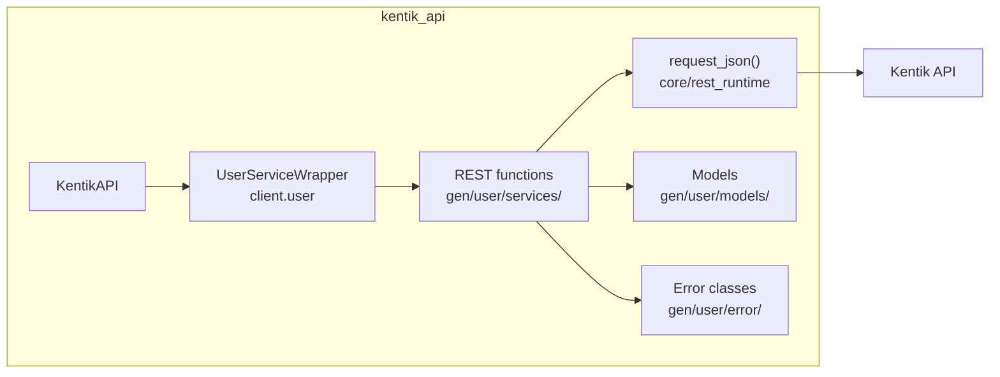

## Endpoints

### `GET` `/user/v202211/users`

List all users.

Returns a list of all user accounts in the company.

**REST transport**

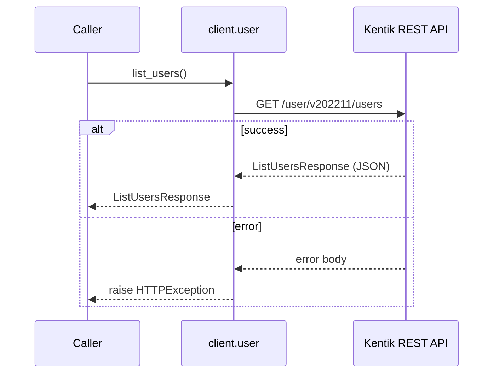

**gRPC transport**

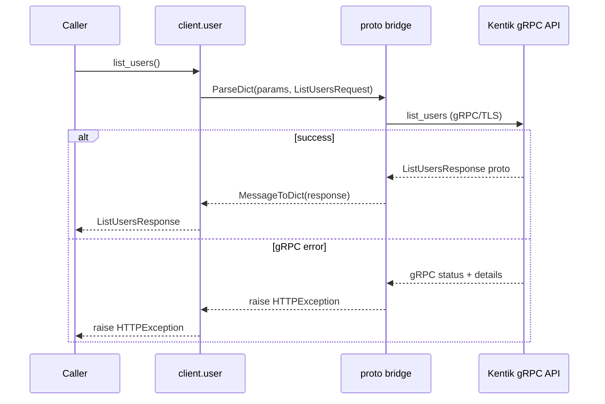

#### Responses

| Status | Description | Model |
| --- | --- | --- |
| 200 | A successful response. | `ListUsersResponse` |
| default | An unexpected error response. | `rpcStatus` |

#### Example

```python
from kentik_api.client import KentikAPI

# Both transports work: protocol="rest" (default) or protocol="grpc".
client = KentikAPI(protocol="rest")  # loads KENTIK_EMAIL/KENTIK_API_TOKEN from .env
response = client.user.list_users()
```

---

### `POST` `/user/v202211/users`

Create new user account.

Creates new user account based on attributes in the request. Returns attributes of the newly created account.

**REST transport**

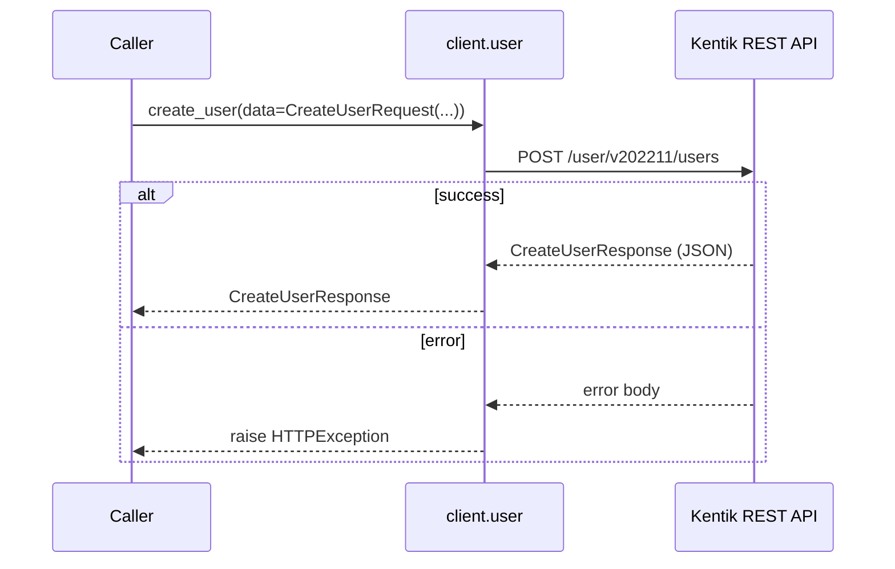

**gRPC transport**

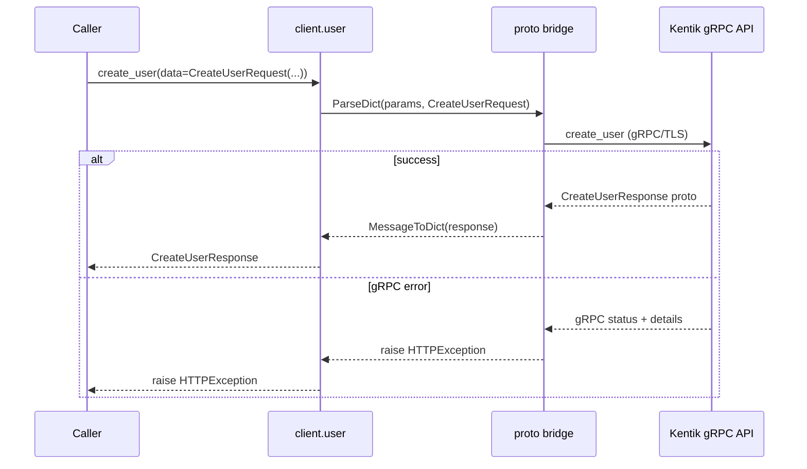

#### Parameters

| Name | In | Type | Required |
| --- | --- | --- | --- |
| `data` | body | `CreateUserRequest` | Yes |

#### Responses

| Status | Description | Model |
| --- | --- | --- |
| 200 | A successful response. | `CreateUserResponse` |
| default | An unexpected error response. | `rpcStatus` |

#### Example

```python
from kentik_api.client import KentikAPI

# Both transports work: protocol="rest" (default) or protocol="grpc".
client = KentikAPI(protocol="rest")  # loads KENTIK_EMAIL/KENTIK_API_TOKEN from .env
response = client.user.create_user(
    data=CreateUserRequest(...),
)
```

---

### `GET` `/user/v202211/users/{id}`

Get attributes of a user account.

Returns attributes of a user account specified by ID.

**REST transport**

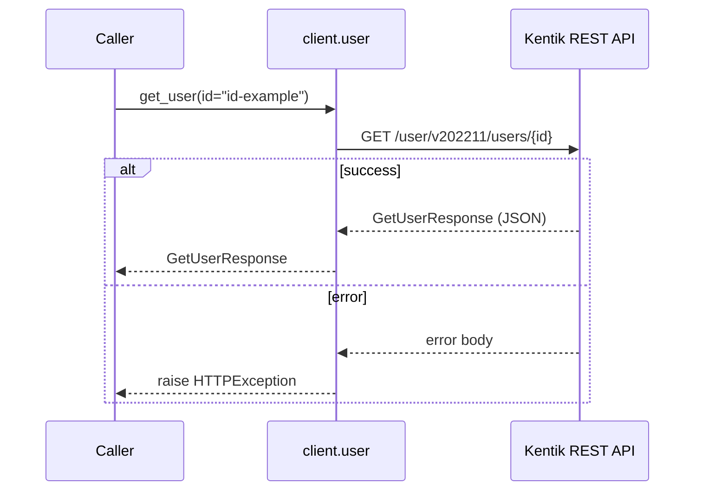

**gRPC transport**

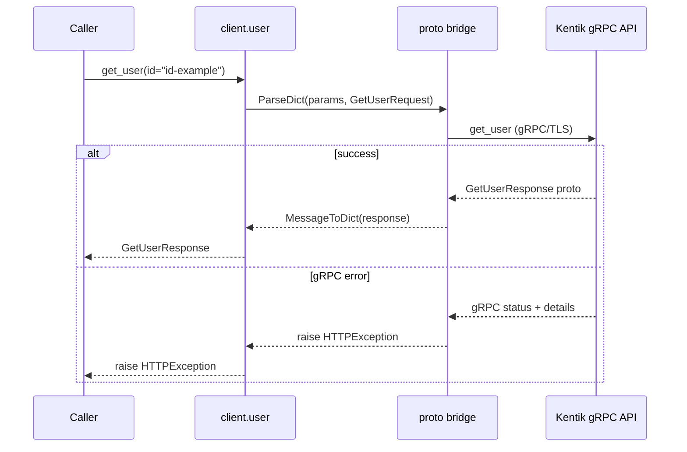

#### Parameters

| Name | In | Type | Required |
| --- | --- | --- | --- |
| `id` | path | `string` | Yes |

#### Responses

| Status | Description | Model |
| --- | --- | --- |
| 200 | A successful response. | `GetUserResponse` |
| default | An unexpected error response. | `rpcStatus` |

#### Example

```python
from kentik_api.client import KentikAPI

# Both transports work: protocol="rest" (default) or protocol="grpc".
client = KentikAPI(protocol="rest")  # loads KENTIK_EMAIL/KENTIK_API_TOKEN from .env
response = client.user.get_user(
    id="id-example",
)
```

---

### `PUT` `/user/v202211/users/{id}`

Update attributes of a user account.

Replaces all attributes of a user account specified by ID with attributes in the request. Returns updated attributes.

**REST transport**

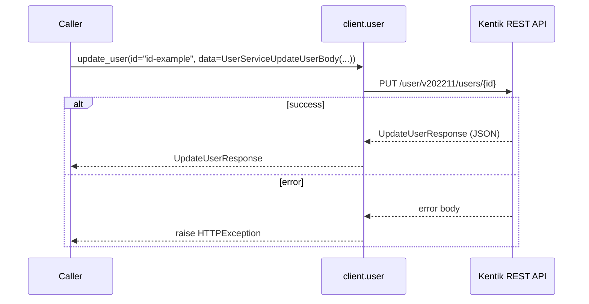

**gRPC transport**

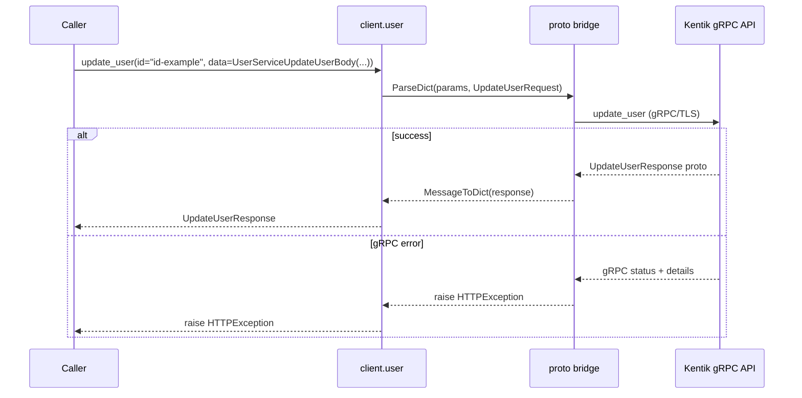

#### Parameters

| Name | In | Type | Required |
| --- | --- | --- | --- |
| `id` | path | `string` | Yes |
| `data` | body | `UserServiceUpdateUserBody` | Yes |

#### Responses

| Status | Description | Model |
| --- | --- | --- |
| 200 | A successful response. | `UpdateUserResponse` |
| default | An unexpected error response. | `rpcStatus` |

#### Example

```python
from kentik_api.client import KentikAPI

# Both transports work: protocol="rest" (default) or protocol="grpc".
client = KentikAPI(protocol="rest")  # loads KENTIK_EMAIL/KENTIK_API_TOKEN from .env
response = client.user.update_user(
    id="id-example",
    data=UserServiceUpdateUserBody(...),
)
```

---

### `DELETE` `/user/v202211/users/{id}`

Delete a user account.

Deletes user account specified by ID.

**REST transport**

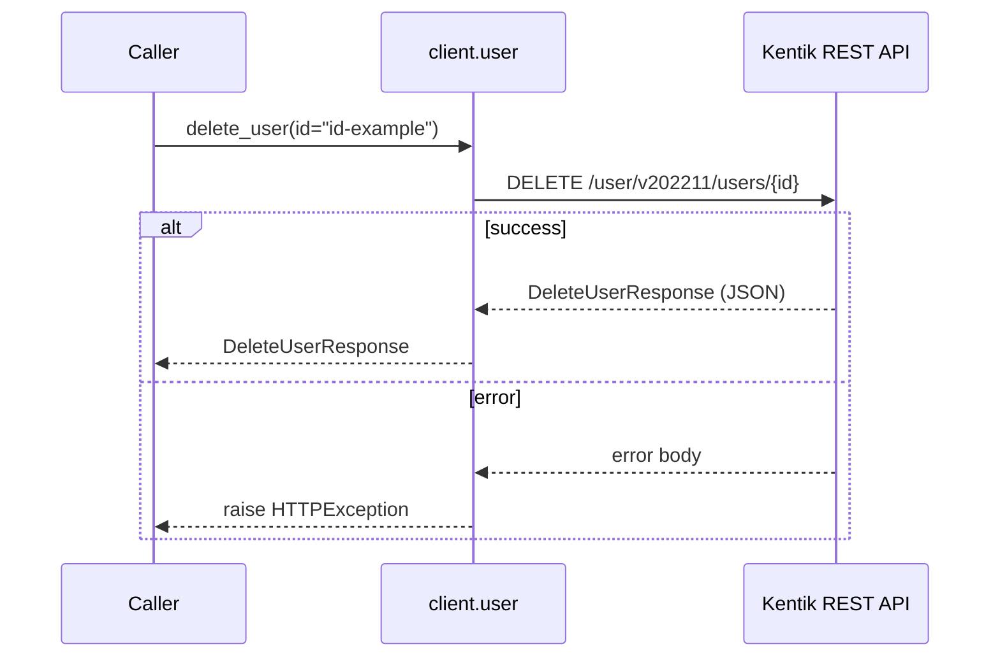

**gRPC transport**

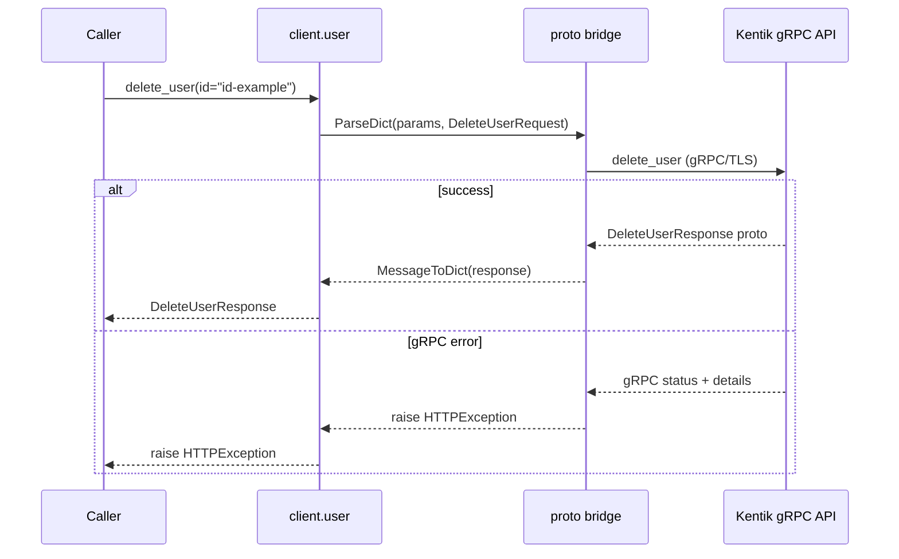

#### Parameters

| Name | In | Type | Required |
| --- | --- | --- | --- |
| `id` | path | `string` | Yes |

#### Responses

| Status | Description | Model |
| --- | --- | --- |
| 200 | A successful response. | `DeleteUserResponse` |
| default | An unexpected error response. | `rpcStatus` |

#### Example

```python
from kentik_api.client import KentikAPI

# Both transports work: protocol="rest" (default) or protocol="grpc".
client = KentikAPI(protocol="rest")  # loads KENTIK_EMAIL/KENTIK_API_TOKEN from .env
response = client.user.delete_user(
    id="id-example",
)
```

---

### `PUT` `/user/v202211/users/{id}/reset_active_sessions`

Resets active sessions for a user.

Resets active sessions for a user specified by ID.

**REST transport**

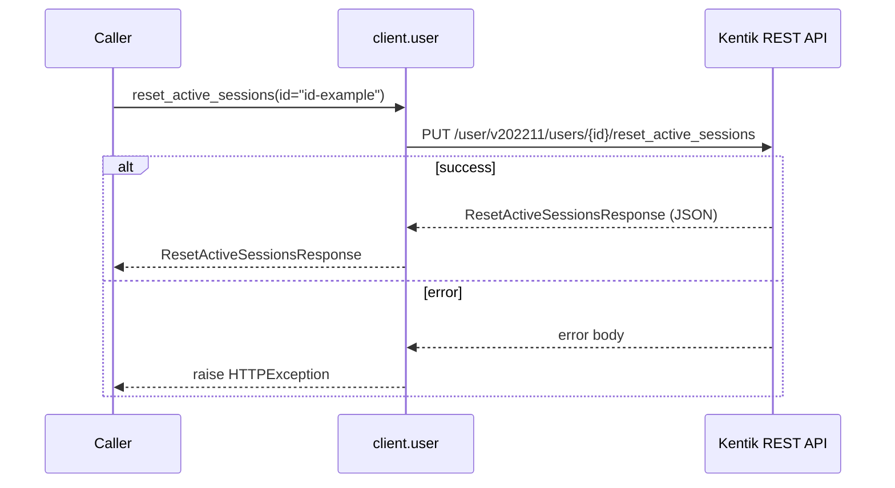

**gRPC transport**

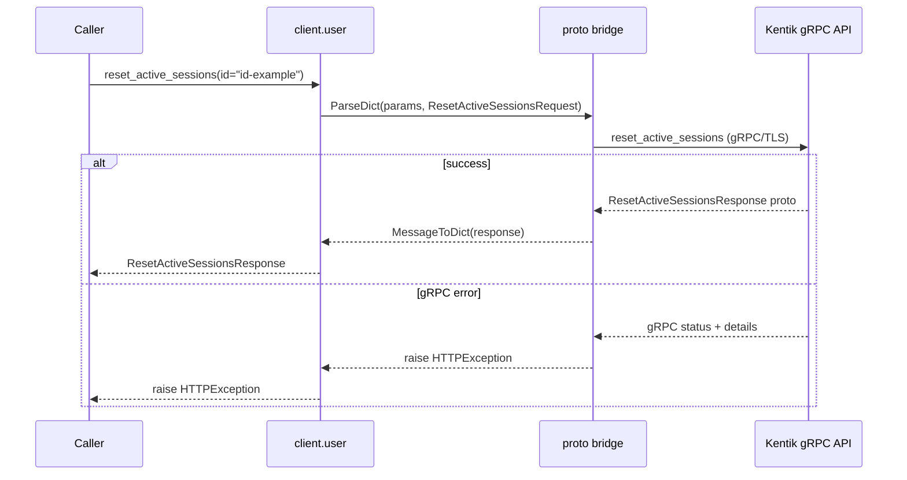

#### Parameters

| Name | In | Type | Required |
| --- | --- | --- | --- |
| `id` | path | `string` | Yes |

#### Responses

| Status | Description | Model |
| --- | --- | --- |
| 200 | A successful response. | `ResetActiveSessionsResponse` |
| default | An unexpected error response. | `rpcStatus` |

#### Example

```python
from kentik_api.client import KentikAPI

# Both transports work: protocol="rest" (default) or protocol="grpc".
client = KentikAPI(protocol="rest")  # loads KENTIK_EMAIL/KENTIK_API_TOKEN from .env
response = client.user.reset_active_sessions(
    id="id-example",
)
```

---

### `PUT` `/user/v202211/users/{id}/reset_api_token`

Reset API token for a user.

Resets API token for a user specified by ID.

**REST transport**

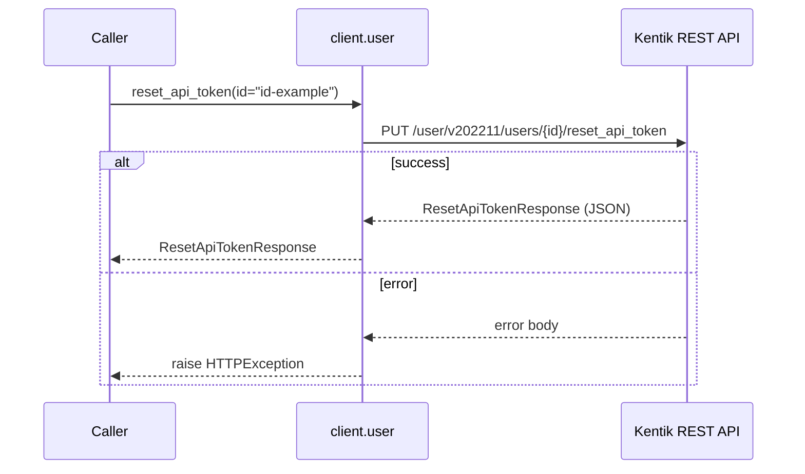

**gRPC transport**

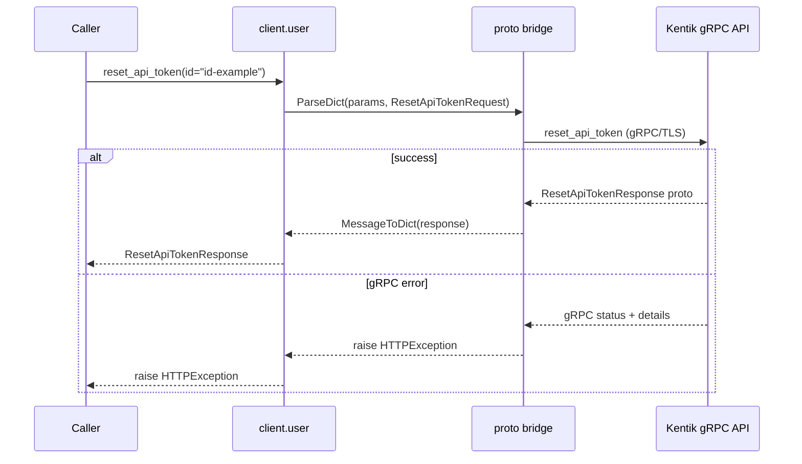

#### Parameters

| Name | In | Type | Required |
| --- | --- | --- | --- |
| `id` | path | `string` | Yes |

#### Responses

| Status | Description | Model |
| --- | --- | --- |
| 200 | A successful response. | `ResetApiTokenResponse` |
| default | An unexpected error response. | `rpcStatus` |

#### Example

```python
from kentik_api.client import KentikAPI

# Both transports work: protocol="rest" (default) or protocol="grpc".
client = KentikAPI(protocol="rest")  # loads KENTIK_EMAIL/KENTIK_API_TOKEN from .env
response = client.user.reset_api_token(
    id="id-example",
)
```

## Data Models

<details>
<summary>Model relationships (12 of 15 models)</summary>

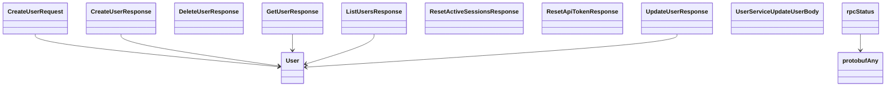

</details>

```{eval-rst}
.. autopydantic_model:: kentik_api.gen.user.models.CreateUserRequest
```

```{eval-rst}
.. autopydantic_model:: kentik_api.gen.user.models.CreateUserResponse
```

```{eval-rst}
.. autopydantic_model:: kentik_api.gen.user.models.DeleteUserResponse
```

```{eval-rst}
.. autopydantic_model:: kentik_api.gen.user.models.GetUserResponse
```

```{eval-rst}
.. autoclass:: kentik_api.gen.user.models.LandingType
   :members:
```

```{eval-rst}
.. autopydantic_model:: kentik_api.gen.user.models.ListUsersResponse
```

```{eval-rst}
.. autopydantic_model:: kentik_api.gen.user.models.PermissionEntry
```

```{eval-rst}
.. autopydantic_model:: kentik_api.gen.user.models.ResetActiveSessionsResponse
```

```{eval-rst}
.. autopydantic_model:: kentik_api.gen.user.models.ResetApiTokenResponse
```

```{eval-rst}
.. autoclass:: kentik_api.gen.user.models.Role
   :members:
```

```{eval-rst}
.. autopydantic_model:: kentik_api.gen.user.models.UpdateUserResponse
```

```{eval-rst}
.. autopydantic_model:: kentik_api.gen.user.models.User
```

```{eval-rst}
.. autopydantic_model:: kentik_api.gen.user.models.UserServiceUpdateUserBody
```

```{eval-rst}
.. autopydantic_model:: kentik_api.gen.user.models.protobufAny
```

```{eval-rst}
.. autopydantic_model:: kentik_api.gen.user.models.rpcStatus
```
