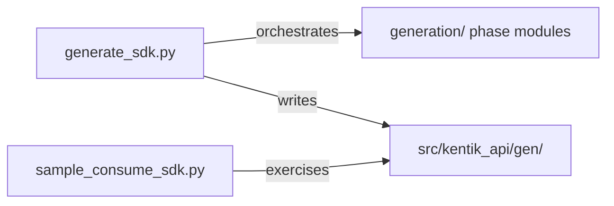

# Generation Scripts

This folder holds the SDK generator entrypoint and a sample consumer
script. Both are hand-written and survive every `make generate` run.

## Layout

| Path | Role |
| --- | --- |
| `generate_sdk.py` | Entrypoint. Orchestrates schema download, per-file generation, and every phase module. |
| `sample_consume_sdk.py` | Standalone demo of the generated SDK, in mock mode and real mode. |
| `generation/` | The generator's phase modules. See [generation/README.md](generation/README.md). |
| `openapi_templates/` | Custom Jinja2 templates fed into the OpenAPI generator. See [openapi_templates/README.md](openapi_templates/README.md). |



## Run the generator

```bash
# From the public schema repo (default)
uv run python scripts/generate_sdk.py

# From a local checkout of api-schema-public
uv run python scripts/generate_sdk.py --local-repo ../api-schema-public
```

`make generate` and `make generate local` wrap these two invocations.
See [`docs/guides/generation.md`](../docs/guides/generation.md) for
the full regeneration workflow.

## Makefile commands

| Command | Effect |
| --- | --- |
| `make` | Generate services and run tests (default) |
| `make generate` | Regenerate from remote schema |
| `make generate local` | Regenerate from `../api-schema-public/` |
| `make generate LOCAL_REPO=/path` | Regenerate from an arbitrary path |
| `make services` | Alias for `make generate` |
| `make docs` | Build Sphinx HTML from [`docs/sphinx/`](../docs/sphinx/README.md) |
| `make test` | Full mocked test suite |
| `make test-e2e` | Live API tests (opt-in, needs `.env`) |
| `make lint` | Ruff check + format |
| `make clean` | Remove [`src/kentik_api/gen/`](../src/kentik_api/gen/README.md) and build artifacts |

> [!NOTE]
> Two environment variables let you test a forked
> `openapi-python-generator` build without editing this script:
> `OPENAPI_GENERATOR_FROM` (a `uvx --from` source, for example
> `git+https://github.com/<org>/<repo>.git`) and
> `OPENAPI_GENERATOR_CMD` (the executable name, if it differs from
> `openapi-python-generator`).

## Run the sample consumer

```bash
# Mock mode: patches one generated REST call, makes no network request
uv run python scripts/sample_consume_sdk.py

# Real mode: calls the live Kentik API using .env credentials
uv run python scripts/sample_consume_sdk.py --real
```

`run_mock_demo()` proves the generated call path end-to-end without
credentials. `run_real_call()` tries `device.list_devices()` first,
then falls back to `user.list_users()`, so the script still succeeds
against an account that lacks one of those permissions.

## Generator patches (internal)

If you modify [`generate_sdk.py`](generate_sdk.py), these post-processing
patches in the generation loop are the most likely areas to break:

| Patch | What it does |
| --- | --- |
| Flattened structure | Removes version subdirectories; keeps only the latest version of each service |
| Wildcard patching | Replaces `from .models import *` with explicit re-exports (`import X as X`) |
| Ghost data fix | Removes `json=data.dict()` calls in functions where no payload arg was generated |
| Pydantic v2 | Injects `.model_construct()` for empty API responses to prevent validation crashes |

See [`generation/README.md`](generation/README.md) for the phase module
breakdown and call order.
