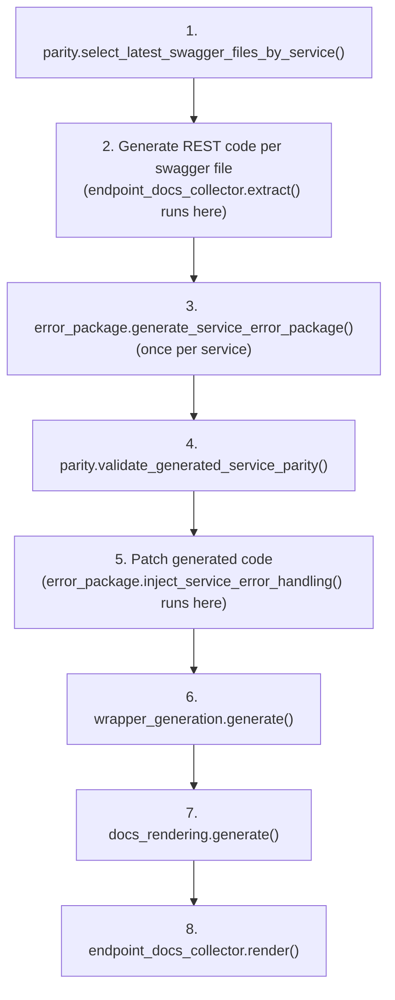

<!-- HAND-WRITTEN: not modified by [`make generate`](../../Makefile). Edit directly. -->

# Generator Phase Modules

`scripts/generate_sdk.py` builds the SDK from Kentik's OpenAPI schema.
It handles CLI parsing and orchestration only. Each module in this
package owns one concern of SDK generation.

## Modules

| Module | Owns | Public interface |
| --- | --- | --- |
| [`parity.py`](parity.py) | Swagger file selection and directory parity checks | `select_latest_swagger_files_by_service()`, `validate_generated_service_parity()` |
| [`error_package.py`](error_package.py) | Error class generation and error dispatch | `generate_service_error_package()`, `inject_service_error_handling()` |
| [`wrapper_generation.py`](wrapper_generation.py) | Service wrapper and client mixin generation | `generate()` |
| [`docs_rendering.py`](docs_rendering.py) | Architecture diagrams and service READMEs | `generate()` |
| [`endpoint_docs.py`](endpoint_docs.py) | Per-endpoint Sphinx documentation | `EndpointDocsCollector` |
| [`_shared.py`](_shared.py) | Constants and helpers shared by two or more phase modules | `PROJECT_ROOT`, `SDK_OUTPUT_DIR`, `discover_service_model_classes()`, `service_to_pascal_case()` |

Keep a helper in `_shared.py` only when two or more phase modules call
it. Put a single-consumer helper in the one module that calls it
instead.

## Call order

`generate_modular_sdk()` in `scripts/generate_sdk.py` calls the phase
modules in this order:



> [!WARNING]
> Call `endpoint_docs_collector.render()` only after
> `wrapper_generation.generate()` finishes. `render()` reads wrapper
> method signatures from the files that `wrapper_generation.generate()`
> writes.

## Import rules

`scripts/generate_sdk.py` runs as a direct script:
`uv run python scripts/generate_sdk.py`. Python puts `scripts/` on
`sys.path` automatically for a direct script run. `generate_sdk.py`
imports this package as `from generation import ...`.

Tests import the same modules as `from scripts.generation import ...`.
The `pythonpath = ["."]` setting in `pyproject.toml` adds the repo root
to `sys.path` for tests.

Both import styles load the same files under different top-level
names. Use a relative import (`from ._shared import ...`) for every
import between files inside this package. A relative import resolves
correctly under either name. An absolute `scripts.generation.*` import
inside this package breaks `generate_sdk.py`'s import path.

## Add a new phase module

1. Create `scripts/generation/<name>.py`.
2. Give it one small public interface. A single `generate()` function
   is usually enough. Use more than one function only when the
   module's steps run at different points in the orchestration.
3. Import shared helpers from `._shared` with a relative import.
4. Call the new module from `generate_modular_sdk()` in
   `scripts/generate_sdk.py`.
5. Add tests under `tests/generator/test_<name>.py`.

## Run the tests

```bash
make test-generator
```

This command runs only the tests in `tests/generator/`. Each test
builds its own temporary swagger fragment or fake generated-file
fixture with `tmp_path`. No test in this suite needs a real or local
schema checkout.
