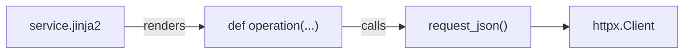

<!-- HAND-WRITTEN: not modified by `make generate`. Edit directly. -->

# OpenAPI Generator Templates

Custom Jinja2 templates fed into `openapi-python-generator` via
`--custom-template-path` (see `openapi_generator_cmd()` in
[../generate_sdk.py](../generate_sdk.py)). They override the
generator's default per-operation and per-module output so every
generated call routes through the shared REST runtime instead of
hand-rolled HTTP code.

## Files

| Template | Replaces | Purpose |
| --- | --- | --- |
| `httpx.jinja2` | Per-service module header | Imports `request_json` and the wildcard model/`typing` imports every generated operation needs. |
| `service.jinja2` | Per-operation function body | Builds `query_params`/`header_params`, calls `request_json(...)`, and converts the raw JSON body into the declared Pydantic model or list. |

## Why these exist

Without a custom template, `openapi-python-generator` emits a direct
`httpx` call per operation. That duplicates auth headers, error
handling, and status checks across every one of the ~38 generated
services. `service.jinja2` instead calls
[`request_json()`](../../src/kentik_api/core/rest_runtime.py), the
single shared function that owns all of that. See the "shared
connection handler" section of the repository root
[CLAUDE.md](../../CLAUDE.md) for why this pattern must not regress.

## Editing a template

1. Change the `.jinja2` file here, not the generated output.
2. Regenerate: `uv run python scripts/generate_sdk.py --local-repo
   ../api-schema-public`.
3. Diff a generated service module to confirm the new output shape.
4. Run `make test-generated` to confirm generated calls still exercise
   `request_json` and every declared response status.

> [!WARNING]
> `service.jinja2` must keep calling `request_json` by that exact
> name and import path. `error_package.inject_service_error_handling()`
> string-matches the line
> `from kentik_api.core.rest_runtime import request_json` to wire in
> per-service error classes. Renaming or relocating it here silently
> breaks that injection for every service.
