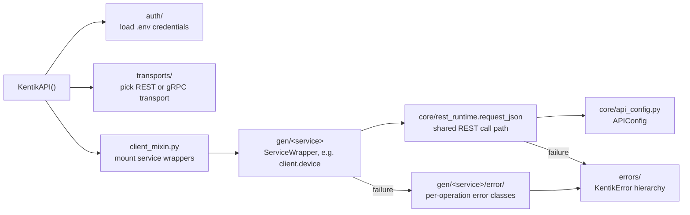

# `kentik_api` Package

The top-level package for the Kentik Community Python SDK. See the
repository root [README.md](../../README.md) for installation and
usage, and [CLAUDE.md](../../CLAUDE.md) for the full
hand-written-vs-generated architecture.

## Layout

| Path | Role |
| --- | --- |
| `client.py` | Hand-written. `KentikAPI`, the SDK's entrypoint: loads credentials, picks a transport, mounts every generated service. |
| `client_mixin.py` | Generated. Mounts every service wrapper onto `KentikAPI` as a typed attribute (`client.device`, `client.user`, and so on). |
| `auth/` | Hand-written. See [auth/README.md](auth/README.md). |
| `core/` | Hand-written. The shared REST runtime every generated call routes through. See [core/README.md](core/README.md). |
| `errors/` | Hand-written. The base exception hierarchy every generated error class builds on. See [errors/README.md](errors/README.md). |
| `transports/` | Hand-written. REST/gRPC transport selection. See [transports/README.md](transports/README.md). |
| `gen/` | Fully generated, one directory per Kentik API service. See [gen/README.md](gen/README.md). |

## Request flow

The diagram below traces one API call through these pieces, from
`KentikAPI()` construction to a successful response or a raised
error.



Every generated operation, in every service, calls
`core/rest_runtime.request_json` the same way. No service wrapper
implements its own HTTP, auth, or error-parsing logic.

## Using the client

```python
from kentik_api.client import KentikAPI

client = KentikAPI()  # loads KENTIK_EMAIL/KENTIK_API_TOKEN from .env
devices = client.device.list_devices()
```

`KentikAPI` never implements per-service logic itself. It wires
together the hand-written pieces above with whatever `gen/` produces,
so extending SDK behavior always means changing one of those pieces,
never `client.py` itself.
