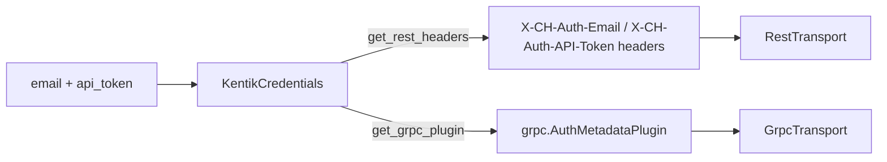

# Credentials (`kentik_api.auth`)

Hand-written. Not touched by `make generate`.

`KentikCredentials` is the one place that turns a Kentik email and API
token into the two transport-specific auth shapes the SDK needs: REST
headers and a gRPC auth plugin.

## `KentikCredentials`

```python
from kentik_api.auth.credentials import KentikCredentials

creds = KentikCredentials(email="you@example.com", api_token="...")
```

| Method | Returns | Used by |
| --- | --- | --- |
| `get_rest_headers()` | A `dict` with `X-CH-Auth-Email`, `X-CH-Auth-API-Token`, and `Content-Type`. | [`RestTransport`](../transports/rest_client.py) |
| `get_grpc_plugin()` | A `grpc.AuthMetadataPlugin` that injects the same two headers as gRPC call metadata. | [`GrpcTransport`](../transports/grpc_client.py) |

## Shape

One credential pair becomes the two transport-specific auth shapes:



## Where credentials actually get read

`KentikCredentials` only holds and formats values passed to it. Loading
`KENTIK_EMAIL` / `KENTIK_API_TOKEN` from a project-root `.env` file
happens in [`KentikAPI`](../client.py), the SDK's public entrypoint, not
here. See "Auth/config" in the repository root
[CLAUDE.md](../../../CLAUDE.md) for the full precedence rules (explicit
constructor args win over `.env`).
