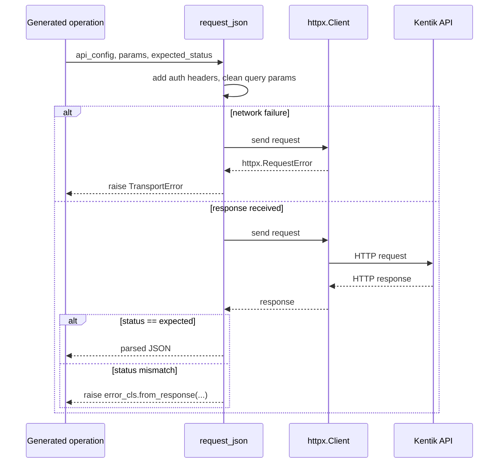
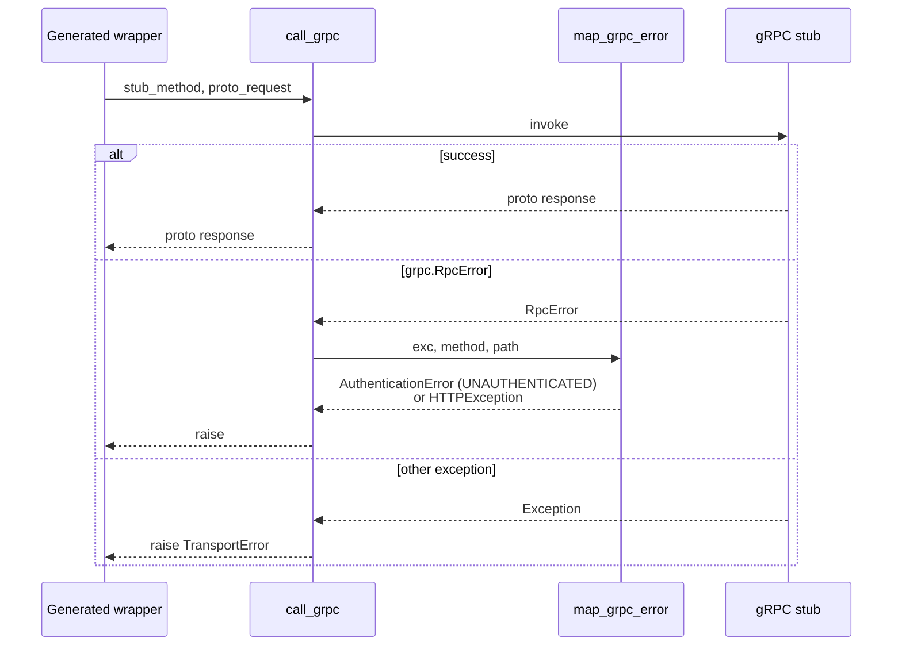

<!-- HAND-WRITTEN: not modified by [`make generate`](../../../Makefile). Edit directly. -->

# Shared Runtime (`kentik_api.core`)

Hand-written. Not touched by [`make generate`](../../../Makefile). This is the most
significant hand-written engineering in the SDK: every generated
operation, across every service, routes through one function in this
folder: [`request_json()`](rest_runtime.py) for REST, and
[`call_grpc()`](grpc_runtime.py) for gRPC.

## `APIConfig`

`APIConfig` (in [`api_config.py`](api_config.py)) is the shared config object passed to
every generated call: base URL, auth email, auth token, and TLS
`verify`. [`RestTransport`](../transports/rest_client.py) builds one
from [`KentikCredentials`](../auth/credentials.py) once, in `__init__`.
Generated wrapper methods read `api_config` off the transport and
forward it as `api_config_override`.

## `request_json()`

`request_json()` (in [`rest_runtime.py`](rest_runtime.py)) is the **only** function that
calls `httpx` for REST traffic in this SDK. Every generated operation,
in every one of the ~39 services under
[`src/kentik_api/gen/`](../gen/README.md), calls this same function through the
`httpx.jinja2` template. See
[`scripts/openapi_templates/`](../../../scripts/openapi_templates/README.md).

## `map_grpc_error()` and `call_grpc()`

`map_grpc_error()` (in [`grpc_runtime.py`](grpc_runtime.py)) is a pure function:
no I/O, no side effects, testable without a gRPC channel. It maps a
`grpc.RpcError` status code to the SDK exception hierarchy (`AuthenticationError`
or `HTTPException`). `call_grpc()` is the thin caller that invokes the gRPC stub
and delegates all error mapping to `map_grpc_error()`.

`request_json()` centralizes:

- Kentik's auth header scheme (`X-CH-Auth-Email` /
  `X-CH-Auth-API-Token`)
- Query-param cleaning (drops `None` values)
- The request itself, via a short-lived `httpx.Client`
- Transport-failure wrapping into `TransportError`
- Status-code checking against each operation's `expected_status`
- JSON error-body parsing (`code`, `message`, `details`)
- Dispatch into the operation's generated error class via
  `error_cls.from_response`

## Extending this layer

Fix or extend `request_json()` or `APIConfig` here. Never add
per-endpoint HTTP, auth, or retry code to a generated service wrapper,
and never inline request logic to "simplify" one call site. See "The
shared connection handler" in the repository root
[CLAUDE.md](../../../CLAUDE.md) for the full rationale and the commits
that shaped this design.
