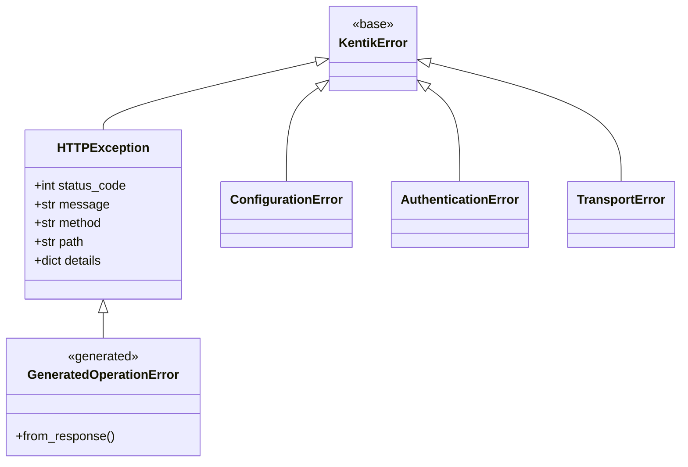

<!-- HAND-WRITTEN: not modified by [`make generate`](../../../Makefile). Edit directly. -->

# Errors (`kentik_api.errors`)

Hand-written. Not touched by [`make generate`](../../../Makefile). This is the one shared
exception hierarchy every generated per-service error class builds on.

## Hierarchy

`GeneratedOperationError` stands in for the per-operation classes each
service generates under `gen/<service>/error/`.

| Class | Raised when |
| --- | --- |
| `KentikError` | Base class for every SDK-specific error. Catch this to handle any SDK failure. |
| `ConfigurationError` | Reserved for an invalid `APIConfig` value; defined for callers to catch, but not currently raised anywhere in the SDK. |
| `AuthenticationError` | gRPC only: `map_grpc_error()` raises this for a gRPC `UNAUTHENTICATED` status. A REST 401 raises a generated `HTTPException` subclass instead (see below), not `AuthenticationError`. |
| `TransportError` | The transport layer fails before a response arrives (raised by [`request_json()`](../core/rest_runtime.py) on an `httpx.RequestError`, or by `call_grpc()` on a non-`RpcError` exception). |
| `HTTPException` | An HTTP response doesn't match the operation's expected status. Carries `status_code`, `message`, `method`, `path`, and a `details` dict (parsed from the response body when possible). |

## Generated per-operation error classes

Each service's generated `error/__init__.py` declares one `HTTPException`
subclass per operation, plus a `response_error_map` from status code to
class. `request_json()` calls `error_cls.from_response(...)` to build
the right one. See
[`tests/generated/test_endpoint_schema_coverage.py`](../../../tests/generated/test_endpoint_schema_coverage.py)
for how every declared status code gets exercised against this
mapping.

## Adding a new base error

Add it here, alongside the existing four, and export it from
`__all__`. Never add a new error type inside a generated
`gen/<service>/error/` file; that file is fully regenerated on every
[`make generate`](../../../Makefile) run.
