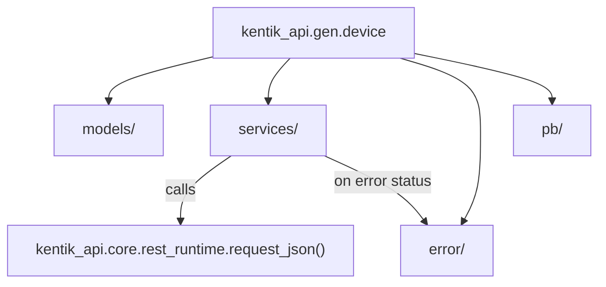

# Generated Services (`kentik_api.gen`)

Fully generated. Every `make generate` run wipes and rebuilds every
subdirectory here, and rewrites this file too. **Never hand-edit
anything under this folder**, including this README. If output here is
wrong, fix the generator (`scripts/generate_sdk.py`, a phase module in
[`scripts/generation/`](../../../scripts/generation/README.md)), or a
template in
[`scripts/openapi_templates/`](../../../scripts/openapi_templates/README.md).
Then regenerate.

## Layout

Each subdirectory is one Kentik API service (`device`, `alerting`,
`user`, and so on), built from that service's OpenAPI v3 schema files.
Every service directory has the same shape:

| Path | Contents |
| --- | --- |
| `models/` | Pydantic v2 request/response models |
| `services/` | Raw REST operation functions, plus a unified `<Service>ServiceWrapper` class |
| `error/` | Per-operation error classes, dispatched from each declared response status code |
| `pb/` | gRPC stubs (`*_pb2.py`, `*_pb2_grpc.py`); transport is a stub today, see below |
| `README.md` | One-paragraph pointer to the full Sphinx reference for that service |

## Where a call actually runs

Every generated REST operation, across every service, routes through
one shared function: `request_json()` in
[`kentik_api.core`](../core/README.md). No service directory here
implements its own HTTP, auth, or retry logic. gRPC transport is
intentionally a stub: generated wrapper methods raise
`NotImplementedError` for `GrpcTransport`. Only REST is fully wired.

## Full reference

For endpoint parameters, response shapes, and usage examples per
service, see `docs/source/services/<service>.md`, or the built
Sphinx docs.
