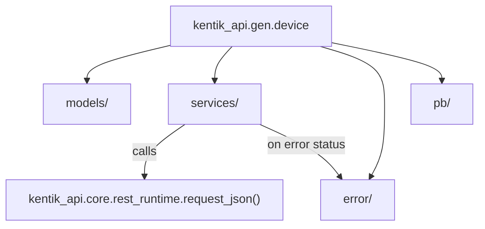

<!-- AUTO-GENERATED: scripts/generation/docs_rendering.py, _generate_gen_root_readme() -->
<!-- Rebuilt on every `make generate`. Do not edit by hand. -->
# Generated Services (`kentik_api.gen`)

Fully generated. Every [`make generate`](../../../Makefile) run wipes and rebuilds every
subdirectory here, and rewrites this file too. **Never hand-edit
anything under this folder**, including this README. If output here is
wrong, fix the generator ([`scripts/generate_sdk.py`](../../../scripts/generate_sdk.py), a phase module in
[`scripts/generation/`](../../../scripts/generation/README.md)), or a
template in
[`scripts/openapi_templates/`](../../../scripts/openapi_templates/README.md).
Then regenerate.

## Layout

Each subdirectory is one Kentik API service (`device`, `alerting`,
`user`, and so on), built from that service's OpenAPI v3 schema files.
Every service directory has the same shape:

| Path | Contents |
| --- | --- |
| `models/` | Pydantic v2 request/response models |
| `services/` | Raw REST operation functions, plus a unified `<Service>ServiceWrapper` class |
| `error/` | Per-operation error classes, dispatched from each declared response status code |
| `pb/` | gRPC stubs (`*_pb2.py`, `*_pb2_grpc.py`) used by the gRPC transport, see below |
| `README.md` | One-paragraph pointer to the full Sphinx reference for that service |

## Where a call actually runs

Every generated REST operation, across every service, routes through
one shared function: `request_json()` in
[`kentik_api.core`](../core/README.md). No service directory here
implements its own HTTP, auth, or retry logic. The gRPC transport is
fully implemented too: a wrapper method routes through `call_grpc()`
in [`kentik_api.core`](../core/README.md) whenever the generator
found a gRPC method matching that REST operation's name. A wrapper
method raises `NotImplementedError` for `GrpcTransport` only when
that service's proto companions failed to import, or when no
matching gRPC method name was found for that operation.

## Full reference

For endpoint parameters, response shapes, and usage examples per
service, see `docs/sphinx/services/<service>.md`, or the built
Sphinx docs.
