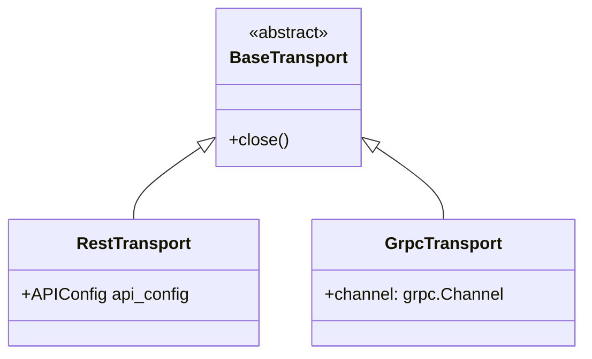

<!-- HAND-WRITTEN: not modified by [`make generate`](../../../Makefile). Edit directly. -->

# Transports (`kentik_api.transports`)

Hand-written. Not touched by [`make generate`](../../../Makefile). Thin transport-selection
and credential-wiring code, not per-endpoint logic.

## Classes

| Class | File | Role |
| --- | --- | --- |
| `BaseTransport` | [`base.py`](base.py) | Abstract base. Declares `close()`. |
| `RestTransport` | [`rest_client.py`](rest_client.py) | Builds an [`APIConfig`](../core/api_config.py) from [`KentikCredentials`](../auth/credentials.py). Generated wrappers read `api_config` off this object. |
| `GrpcTransport` | [`grpc_client.py`](grpc_client.py) | Opens a `grpc.secure_channel` using the credentials' gRPC auth plugin. |



## gRPC

`GrpcTransport` opens a TLS channel to a per-region gRPC endpoint
(`grpc.api.kentik.com:443` for `region="us"`, the default;
`grpc.api.kentik.eu:443` for `region="eu"`), and each service wrapper
routes calls through the compiled proto stubs in `gen/<service>/pb/`.
The `gen/pb_companions/` registry loads all shared proto descriptors
before the stubs are imported. `call_grpc()` in
[`core/grpc_runtime.py`](../core/grpc_runtime.py) normalizes gRPC errors to the same exception
hierarchy as REST.

```python
client = KentikAPI(protocol="grpc")
response = client.device.list_devices()  # works the same as REST
```

## Adding a transport

Add a new `BaseTransport` subclass here, and wire its selection logic
into [`KentikAPI`](../client.py). Keep per-endpoint request logic out
of this folder; that belongs in
[`core/rest_runtime.py`](../core/rest_runtime.py) and
[`core/grpc_runtime.py`](../core/grpc_runtime.py).
