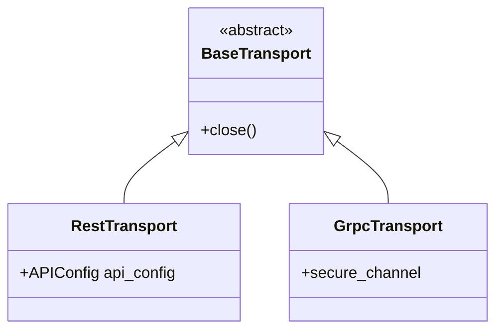

# Transports (`kentik_api.transports`)

Hand-written. Not touched by `make generate`. Thin transport-selection
and credential-wiring code, not per-endpoint logic.

## Classes

| Class | File | Role |
| --- | --- | --- |
| `BaseTransport` | `base.py` | Abstract base. Declares `close()`. |
| `RestTransport` | `rest_client.py` | Builds an [`APIConfig`](../core/api_config.py) from [`KentikCredentials`](../auth/credentials.py). Generated wrappers read `api_config` off this object. |
| `GrpcTransport` | `grpc_client.py` | Opens a `grpc.secure_channel` using the credentials' gRPC auth plugin. |

## gRPC status

`GrpcTransport` opens a real channel and each service wrapper now
contains a full gRPC call path (`ParseDict` → `call_grpc` →
`MessageToDict` → `model_validate`). Two proto companion packages are
not yet bundled with the SDK:

- `protoc-gen-openapiv2/options/annotations.proto` (from grpc-gateway)
- `kentik/core/v202303/annotations.proto` (Kentik-internal)

Until those are compiled and included, the stub load inside `__init__`
fails silently and each method raises
`NotImplementedError("gRPC proto dependencies not installed ...")`. No
code change is needed once the companions are bundled. See
[grpc_implementation_spec.md](../../../docs/source/grpc_implementation_spec.md)
for the remaining phases.

## Adding a transport

Add a new `BaseTransport` subclass here, and wire its selection logic
into [`KentikAPI`](../client.py). Keep per-endpoint request logic out
of this folder; that belongs in
[`kentik_api.core.rest_runtime`](../core/README.md).
