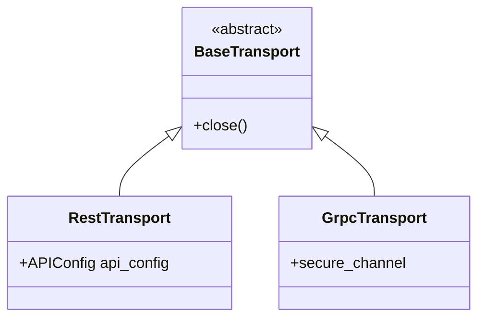

# Transports (`kentik_api.transports`)

Hand-written. Not touched by `make generate`. Thin transport-selection
and credential-wiring code, not per-endpoint logic.

## Classes

| Class | File | Role |
| --- | --- | --- |
| `BaseTransport` | `base.py` | Abstract base. Declares `close()`. |
| `RestTransport` | `rest_client.py` | Builds an [`APIConfig`](../core/api_config.py) from [`KentikCredentials`](../auth/credentials.py). Generated wrappers read `api_config` off this object. |
| `GrpcTransport` | `grpc_client.py` | Opens a `grpc.secure_channel` using the credentials' gRPC auth plugin. |

## gRPC is a stub

`GrpcTransport` opens a real channel, but generated wrapper methods
raise `NotImplementedError` for it. Only REST is fully wired end to
end. See the repository root [CLAUDE.md](../../../CLAUDE.md) for the
current REST/gRPC status.

## Adding a transport

Add a new `BaseTransport` subclass here, and wire its selection logic
into [`KentikAPI`](../client.py). Keep per-endpoint request logic out
of this folder; that belongs in
[`kentik_api.core.rest_runtime`](../core/README.md).
