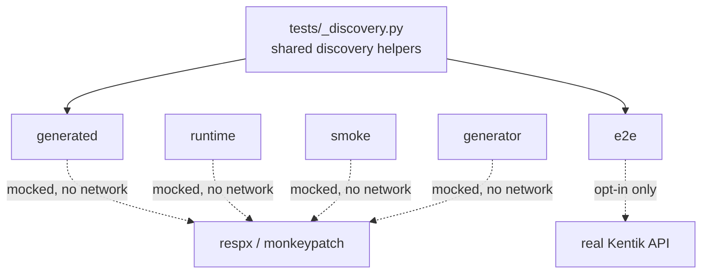

<!-- HAND-WRITTEN: not modified by [`make generate`](../Makefile). Edit directly. -->

# Test Suite Guide

This folder uses a layered testing strategy. Four layers run fully
mocked, with no network access, for fast feedback. A fifth layer,
`e2e`, runs against the real Kentik API for full end-to-end
confidence, over both the REST and gRPC transports. You opt into
that layer explicitly.

## Test layout

| Layer | Scope | Network |
| --- | --- | --- |
| [`generated`](generated/README.md) | Contract tests for every generated snake_case service wrapper, plus exhaustive per-endpoint, per-status-code schema coverage. | Mocked |
| [`runtime`](runtime/README.md) | Focused tests for the shared runtime helpers that generated code calls. | Mocked |
| [`smoke`](smoke/README.md) | Lightweight checks for client wiring and selected wrapper call paths. | Mocked |
| [`generator`](generator/README.md) | Unit tests for the SDK generator's phase modules ([`scripts/generation/`](../scripts/generation/README.md)): error package generation, swagger selection and parity validation, wrapper generation, generated-code post-processing fixups, docs/endpoint-docs rendering, and `scripts/generate_sdk.py`'s own schema-patching helpers. | Mocked |
| [`e2e`](e2e/README.md) | End-to-end tests against the real Kentik API, REST ([`test_endpoints_e2e.py`](e2e/test_endpoints_e2e.py)) and gRPC ([`test_endpoints_e2e_grpc.py`](e2e/test_endpoints_e2e_grpc.py)) transports. Opt-in only, never part of [`make test`](../Makefile) or [`make all`](../Makefile). See [`e2e/README.md`](e2e/README.md) before you touch this layer. | Real |



[`tests/_discovery.py`](_discovery.py) lives at the [`tests/`](.) root, outside any one
layer. It holds the schema and wrapper discovery helpers that
[`generated/`](generated/README.md) and [`e2e/`](e2e/README.md) both use. Sharing one file keeps the two
layers from drifting apart.

[`tests/conftest.py`](conftest.py) puts [`tests/`](.) on `sys.path`. This lets
`import _discovery` resolve the same way from every layer. Neither
file is itself a test file.

## How to run tests

Run these commands from the repository root.

| Goal | Command |
| --- | --- |
| Run every mocked layer | [`make test`](../Makefile) |
| Run generated wrapper contract tests only | [`make test-generated`](../Makefile) |
| Run runtime tests only | [`make test-runtime`](../Makefile) |
| Run smoke tests only | [`make test-smoke`](../Makefile) |
| Run generator unit tests only | [`make test-generator`](../Makefile) |
| Run end-to-end tests against the real API (opt-in, needs a real `.env`) | `make test-e2e` |
| Run end-to-end gRPC-transport tests against the real API (opt-in, needs a real `.env`) | `make test-e2e-grpc` |

You can also call `pytest` directly:

```bash
uv run pytest tests/
uv run pytest tests/generated/
uv run pytest tests/runtime/
uv run pytest tests/smoke/
uv run pytest tests/generator/
uv run pytest -m e2e tests/e2e/
uv run pytest -m e2e_grpc tests/e2e/
```

`pyproject.toml` registers the `e2e` and `e2e_grpc` markers with
`addopts = "-m 'not e2e and not e2e_grpc'"`. Plain `pytest tests/`
always deselects [`tests/e2e/`](e2e/README.md). [`make test`](../Makefile) runs plain `pytest tests/`, so it
deselects [`tests/e2e/`](e2e/README.md) too. Opt in explicitly with `-m e2e` or `-m e2e_grpc`.

## When to run which suite

| Situation | Run this first |
| --- | --- |
| Editing [`scripts/generate_sdk.py`](../scripts/generate_sdk.py), [`scripts/generation/`](../scripts/generation/README.md), or template behavior | [`make test-generator`](../Makefile) for fast feedback on the generator itself, then [`make test-generated`](../Makefile) to check the SDK it produces |
| Editing shared request, auth, or error behavior in [`src/kentik_api/core`](../src/kentik_api/core/README.md) | [`make test-runtime`](../Makefile) |
| Opening a PR or merging | [`make test`](../Makefile) |
| Trusting a schema sync, or a change to error or response handling, against production behavior | `make test-e2e` (needs real credentials; read [End-to-end tests](#5-end-to-end-tests-real-api-opt-in) first); add `make test-e2e-grpc` too if the change touches gRPC translation |

## How to add new tests

### 1) Generated wrapper contract tests

Primary file: [`tests/generated/test_wrapper_contracts.py`](generated/test_wrapper_contracts.py)

Add logic here only when the wrapper contract itself changes
globally: for example, argument forwarding rules, transport
branching behavior, or discovery rules. This suite auto-discovers
wrapper modules. You usually do not add per-service files by hand.

Shared discovery helpers (wrapper and endpoint discovery, plus
sample-value and sample-Pydantic-model builders) live in
[`tests/_discovery.py`](_discovery.py). This file, the schema coverage suite below,
and the e2e suite all read the same helpers, so they stay in sync
automatically.

### 1b) Endpoint and schema coverage tests

Primary file: [`tests/generated/test_endpoint_schema_coverage.py`](generated/test_endpoint_schema_coverage.py)

This suite discovers every operation through `_discovery.py`. It
then exercises each operation against every response status code the
OpenAPI schema declares for it: each service's generated
`error/__init__.py::{Operation}Error.response_error_map`, plus the
success `expected_status`. `respx` mocks the HTTP layer, so the real
`request_json` runtime and the real generated error classes run.
This is what CLAUDE.md's test coverage requirement (every endpoint,
every option, every declared status code) maps to concretely.

This suite drives the actual generated code end-to-end. It does not
stop at the wrapper boundary the way the contract tests above do. So
it also catches generator bugs that only surface at runtime, such as
a model import that silently resolves to the wrong object.

Add logic here only when the status or error coverage strategy
itself changes. A new service, operation, or status code needs no
manual update: the next [`make generate`](../Makefile) picks it up automatically.

### 2) Runtime tests

Primary files:

- [`tests/runtime/test_rest_runtime.py`](runtime/test_rest_runtime.py)
- [`tests/runtime/test_grpc_runtime.py`](runtime/test_grpc_runtime.py)

Add tests when shared runtime behavior changes, such as:

1. Header construction
2. Query filtering
3. Expected-status handling
4. Error-raising behavior

### 3) Smoke tests

Primary file: [`tests/smoke/test_client_mounts_and_calls.py`](smoke/test_client_mounts_and_calls.py)

Add small, high-value checks for overall wiring. Keep this suite
small and fast.

### 4) Generator tests

| File | Covers |
| --- | --- |
| [`tests/generator/test_parity.py`](generator/test_parity.py) | Swagger selection and generated/schema directory parity |
| [`tests/generator/test_error_package.py`](generator/test_error_package.py) | Error class naming, error-response extraction and merging, and the runtime error-dispatch injection seam (including the `ValueError` guard when the anchor is absent) |
| [`tests/generator/test_fixup.py`](generator/test_fixup.py) | Post-generation fixups: `models/__init__.py` rebuild, wildcard-export replacement, file-level content patches, function deduplication, and docstring normalization |
| [`tests/generator/test_wrapper_generation.py`](generator/test_wrapper_generation.py) | Annotation qualification and end-to-end wrapper and client-mixin generation against a temp directory |
| [`tests/generator/test_rest_module_parser.py`](generator/test_rest_module_parser.py) | `scripts/generation/_shared.py`'s `parse_generated_rest_module()`, the shared REST-operation parser `tests/_discovery.py` also uses |
| [`tests/generator/test_endpoint_docs.py`](generator/test_endpoint_docs.py) | `parse_wrapper_methods()`/wrapper-signature parsing in `scripts/generation/endpoint_docs.py` and `_shared.py` |
| [`tests/generator/test_docs_rendering.py`](generator/test_docs_rendering.py) | `scripts/generation/docs_rendering.py`'s `_GROUP_CONFIG`/`_module_group`/`_LAYER_NAMES` consistency (architecture-diagram module grouping) |
| [`tests/generator/test_generate_sdk.py`](generator/test_generate_sdk.py) | `scripts/generate_sdk.py`'s top-level helpers: schema-name cleanup, request-body `$ref` inlining, generated gRPC import rewriting, and the validate-before-clean ordering guard |

Add tests here when `scripts/generation/*.py` logic changes. These
are unit tests against the generator itself, not the SDK it
produces. Most need no real or local schema checkout — build minimal
swagger fragments or fake generated-file fixtures with `tmp_path`
instead. One exception: `test_schema_request_body_coverage` in
`test_generate_sdk.py` cross-checks generated code against the real
local `../api-schema-public` checkout and is skipped automatically
when that checkout is absent.

### 5) End-to-end tests (real API, opt-in)

Primary files:

- [`tests/e2e/conftest.py`](e2e/conftest.py): the `real_client` and `grpc_real_client`
  fixtures. Both delegate all credential loading to `KentikAPI()` (a
  project-root `.env` file, or `KENTIK_EMAIL`/`KENTIK_API_TOKEN`),
  differing only in `protocol="rest"` vs `protocol="grpc"`. Either
  fixture skips the whole suite when no credentials are configured.
- [`tests/e2e/test_endpoints_e2e.py`](e2e/test_endpoints_e2e.py) (REST)
- [`tests/e2e/test_endpoints_e2e_grpc.py`](e2e/test_endpoints_e2e_grpc.py) (gRPC)

Like the other generated-style suites, endpoint discovery comes from
[`tests/_discovery.py`](_discovery.py) (`discover_endpoint_cases()`), not a hand-written
list -- both the REST and gRPC suites share the same discovered
cases and GET-vs-mutating split. Three things set this suite apart
from the mocked ones:

- The suite calls only GET (read-only) operations automatically. A
  read call passes when it returns a correctly-typed response, or
  when it raises a generated `KentikError` subclass. Either outcome
  proves the real request, response, and error path still matches
  what the schema declares. Only a genuinely unexpected exception
  counts as a failure, since the test cannot control what data
  exists in the real account.
- The gRPC variant additionally treats `NotImplementedError` as a
  passing outcome: gRPC coverage is per-operation (see CLAUDE.md's
  "gRPC transport is fully implemented" section), so an operation
  with no gRPC translation yet is expected to raise it, not a bug.
- Create, Update, and Delete operations are deliberately not
  auto-called, in either transport. `test_mutating_endpoint_excluded_from_e2e`
  and `test_mutating_endpoint_excluded_from_e2e_grpc` carry a
  `@pytest.mark.skip` marker on purpose, because a mutating call
  against a real account is hard to reverse. To add live coverage
  for one mutating endpoint, write a dedicated test with its own
  setup and teardown against a disposable resource. Do not wire it
  into the auto-discovered path.

This suite never runs by accident. `addopts` in `pyproject.toml`
excludes both by default; only `make test-e2e`/`-m e2e` (REST) or
`make test-e2e-grpc`/`-m e2e_grpc` (gRPC) runs them. Never hardcode
credentials in test code. Never read or print `.env` contents.

## Guidelines

- Prefer deterministic unit tests over network calls for the
  generated, runtime, and smoke layers.
- Use `monkeypatch`, other mocks, or `respx` for HTTP-level mocking
  in those three layers.
- Keep smoke tests minimal.
- The e2e layer is the one intentional exception to "no network
  calls." Keep it opt-in, read-only by default, and separate from
  the rest of the pipeline.
- If generation output changes, regenerate first: `make generate
  local`. Then run the relevant focused suite. Finally, run
  [`make test`](../Makefile).
