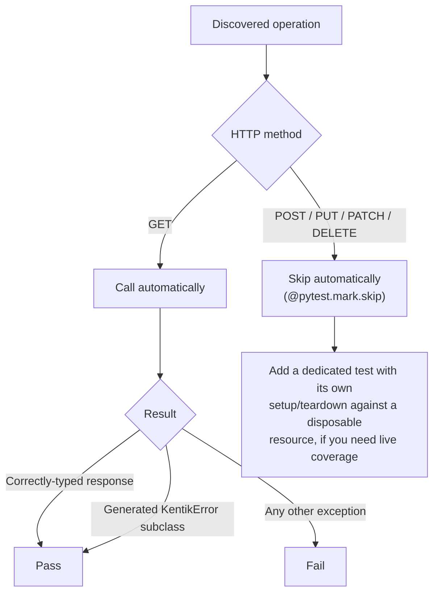

<!-- HAND-WRITTEN: not modified by [`make generate`](../../Makefile). Edit directly. -->

# End-to-End Tests (Real API, Opt-In)

Runs against the real Kentik API. Not part of [`make test`](../../Makefile) or
[`make all`](../../Makefile). See the layered strategy in
[../README.md](../README.md) for how this layer fits with the other
four mocked ones.

> [!WARNING]
> This suite calls a real Kentik account. Read this whole file
> before you add a test here.

## Files

| File | Role |
| --- | --- |
| `conftest.py` | The `real_client` fixture. It delegates all credential loading to `KentikAPI()` (a project-root `.env` file, or `KENTIK_EMAIL`/`KENTIK_API_TOKEN`). It skips the whole suite when no credentials are configured. |
| `test_endpoints_e2e.py` | The end-to-end operation tests. |

Endpoint discovery comes from
[`tests/_discovery.py`](../_discovery.py), the same helper
[`tests/generated/`](../generated/README.md) uses, not a hand-written list.

## How read and mutating operations differ



Only GET (read-only) operations run automatically. A read call
passes when it returns a correctly-typed response, or when it raises
a generated `KentikError` subclass. Either outcome proves the real
request, response, and error path still matches what the schema
declares. Only a genuinely unexpected exception counts as a failure,
since the test cannot control what data exists in the real account.

Create, Update, and Delete operations are deliberately not
auto-called. `test_mutating_endpoint_excluded_from_e2e` carries a
`@pytest.mark.skip` marker on purpose, because a mutating call
against a real account is hard to reverse. To add live coverage for
one mutating endpoint, write a dedicated test with its own setup and
teardown against a disposable resource. Do not wire it into the
auto-discovered path.

## Run

```bash
make test-e2e
```

This suite never runs by accident. `addopts` in `pyproject.toml`
excludes it by default; only `make test-e2e` or `-m e2e` runs it.

## Credentials

Set `KENTIK_EMAIL` and `KENTIK_API_TOKEN` in a project-root `.env`
file. Never hardcode credentials in test code. Never read or print
`.env` contents.
