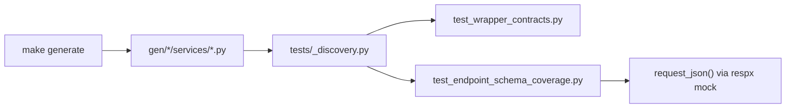

# Generated Wrapper Tests

Mocked, no network. See the layered strategy in
[../README.md](../README.md) for how this layer fits with the other
four.

## Files

| File | Covers |
| --- | --- |
| `test_wrapper_contracts.py` | Contract tests for every generated snake_case service wrapper: argument forwarding, transport branching, and discovery rules. |
| `test_endpoint_schema_coverage.py` | Every discovered operation, run against every response status code the OpenAPI schema declares for it. |

Both files import shared discovery and sample-building helpers from
[`tests/_discovery.py`](../_discovery.py), so they stay in sync with
the e2e suite automatically.



## Run

```bash
make test-generated
# or
uv run pytest tests/generated/
```

## Add a test here

- **`test_wrapper_contracts.py`** auto-discovers wrapper modules by
  parsing `src/kentik_api/gen/*/services/*.py`. Add logic here only
  when the wrapper contract itself changes globally. You usually do
  not add a per-service test by hand.
- **`test_endpoint_schema_coverage.py`** drives the real
  [`request_json`](../../src/kentik_api/core/README.md) runtime and
  the real generated error classes through `respx`-mocked HTTP. Add
  logic here only when the status or error coverage strategy itself
  changes. A new service, operation, or status code needs no manual
  update: the next `make generate` picks it up automatically.

> [!NOTE]
> `test_endpoint_schema_coverage.py` is what CLAUDE.md's test
> coverage requirement (every endpoint, every option, every declared
> status code) maps to concretely.
